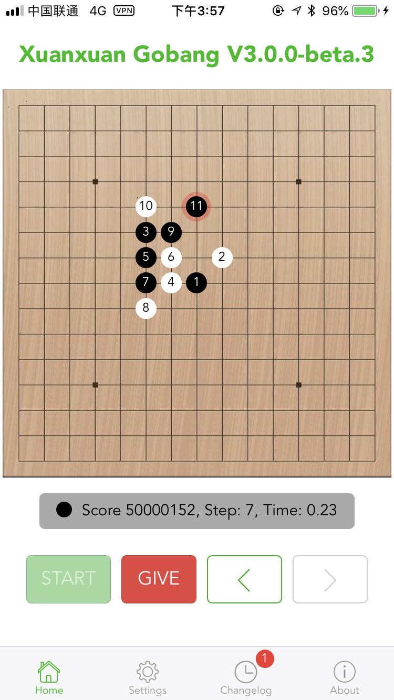

## 五子棋AI

✨🎉🎉🎉✨ 2023/11 重写了全部代码，代码更加简洁易懂，并修复了之前存在的AI可能会偶尔走错棋的问题，棋力更加稳定，React也更新到了最新的V18版本。

***本仓库代码仅供个人业余研究AI用，代码肯定存在有很多不完善的地方，精力和专业所限请谅解***

极小化极大算法的五子棋AI实现。 扫描上方二维码，或者打开此页面可以直接体验 [http://gobang2.light7.cn/](http://gobang2.light7.cn/)

如果你对机器学习、神经网络有兴趣，这里有一个基于Alpha Zero原理的AI [alpha-zero-gobang](https://github.com/lihongxun945/alpha-zero-gobang) 正在开发中，Tensorflow2.x实现，有兴趣的可以关注交流。

需要交流的同学可以加QQ群 `622613966`,进群验证信息请填写 `gobang`

## 更新日志

- 2023/11/23 更新：V3版本重写了所有代码，现在代码更加简洁易懂，并修复了之前存在的AI可能会偶尔走错棋的问题，棋力更加稳定。
- 2020/11/29 更新: 修复了评分的明显bug，随机开局库可配置，网站已修复，可以愉快玩耍了

## 教程
我写了非常详细的中文教程，教你如何一步步编写自己的五子棋AI：

- [五子棋AI设计教程第二版一：前言](https://github.com/lihongxun945/myblog/issues/11)
- [五子棋AI设计教程第二版二：博弈算法的前世今生](https://github.com/lihongxun945/myblog/issues/12)
- [五子棋AI设计教程第二版三：极小化极大值搜索](https://github.com/lihongxun945/myblog/issues/13)
- [五子棋AI设计教程第二版四：Alpha Beta 剪枝算法](https://github.com/lihongxun945/myblog/issues/14)
- [五子棋AI设计教程第二版五：启发式评估函数](https://github.com/lihongxun945/myblog/issues/15)
- [五子棋AI设计教程第二版六：迭代加深](https://github.com/lihongxun945/myblog/issues/16)
- [五子棋AI设计教程第二版七：Zobrist缓存](https://github.com/lihongxun945/myblog/issues/17)
- [五子棋AI设计教程第二版八：算杀](https://github.com/lihongxun945/myblog/issues/18)
- [五子棋AI设计教程第二版九：性能优化](https://github.com/lihongxun945/myblog/issues/19)

注意教程中的代码与代码仓库的有一定区别，但原理是一样的。

## 安装依赖

先执行 `npm install` 安装依赖。然后有如下命令可用：

- `npm test`  运行单元测试
- `npm run js` 编译JS
- `npm run less` 编译less
- `npm run watch` 进入watch模式 自动编译文件
- `npm run build` 编译生成dist目录

## 基本算法

- 极大极小值搜索
- Alpha Beta剪枝
- 启发式评估函数
- Zobrist缓存
- 迭代加深
- 算杀 VCT
- ...
